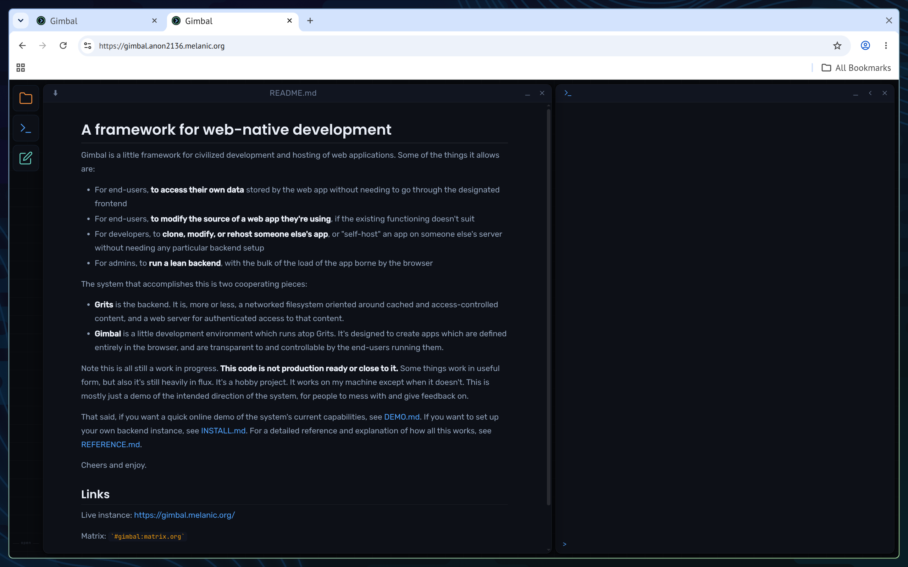
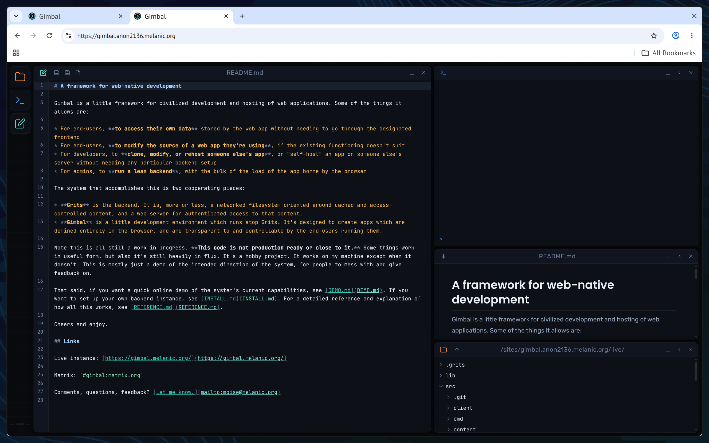

# Demo

What follows is a quick walkthrough of what the system can do right now.

Gimbal is easy to try without installing anything. Go to [gimbal.melanic.org](https://gimbal.melanic.org/). You may be there already.

Specifically, what we will show in these examples is:

1. General Overview
2. How as an end-user to **modify the code of the app you're interacting with**
3. How as an end-user to **clone some existing app into a new vhost that you're fully in charge of**

## 1. General Overview

First, open up Gimbal if you're not already there. What you're looking at is a rudimentary interface into the shared master filesystem that all apps exist in. The best way to understand what you're looking at is to try some simple commands at the terminal prompt (the blue `>`):

```
gimbal.login({guest:1, g:1})   /* start a guest session (persists across tabs) */
gimbal.whoami()                /* check who you are now                        */

home = await gimbal.home()
home.p('hello.txt').write('hello')
home.p('hello.txt').read()
home.ls()
home.p('hello.txt').cp(await home.p('again.txt'))
home.ls()
```

Most of what you're doing is defining path objects within a vaguely Unix-like filesystem and calling methods on them, to do file I/O.

Of course, the point of these objects and commands is not just playing with files in your home directory for its own sake -- it is that all the code for the interface you're looking at, and other Gimbal apps, exists in this same file space, and that you can poke around in *that* and make changes which will then become live for you on the live site.

Let's get into one example of how:

## 2. Modifying Application Code

So Gimbal's editor doesn't do line wrapping:


That's not convenient, but again one of the strengths of Gimbal is that you can fix it for yourself as a regular user. To do this, open up the file browser (the folder icon on your left), open up "src", and double-click "DEMO.md" and you'll see all that un-line-wrapped glory. Then, find your way back here, and I'll show you how to fix it.

The first part of fixing is to make a little clone of the Gimbal code (out of `lib/` from the main site webroot in `gimbal.site()`) in your own file space:

```
gimbal.site().p('lib').cp(await gimbal.home().p('lib'))
```

Second step is to edit the code of the editor, which is a Gimbal widget wrapper around Codemirror. The change we need to make is this:


And, to get to where we can make that change, we do this:

```
gimbal.home().p('lib/codemirror/gwm-widget.js').launch('edit')
```

(In practice, if you noticed something broken in the framework, you would do `gimbal.home().launch('files')` and poke around in `lib/` for a while until you figured out what was responsible and what to do about it. You are free to do that to find `/lib/codemirror/gwm-widget.js` instead of directly opening the offending source, if you would like a more thorough demo.)

Anyway, once the edit is made, the fourth step is to save the file (Ctrl-S). Fifth step is to launch the modified widget into your existing environment:

```
gimbal.site().p('src/DEMO.md').launch(await gimbal.home().p('lib/codemirror/gwm-widget.js'))
```

Did it work? It worked for me:


(Note that if you change the source *again*, you must reload this tab for the changes to take effect. We don't try to monkey with Javascript's `import()` semantics, so once something's importe, it's imported, and you'll have to reload the tab to re-import it.)

Changing or examining the code of a running web app really doesn't take long once you're familiar with the framework. We can't modify the "core" functionality of the site, because we're obviously not allowed to modify actual code in `/lib/` on `gimbal.melanic.org` (although, see the next section!), but we can run custom widgets from `home()/lib/` which we define, which lets us fix bugs in the widgets and then use the fixed versions instead.

If you're up for a little more in-depth example, you're welcome to proceed to the next section, where we will deploy a modified clone of the whole gimbal.melanic.org, which lets us fix things anywhere without needing custom launch commands to run the editor or anything like that.

## 3. Cloning and Modifying a Site

The widget-patching approach above is useful for small changes, but if you want a fully independent copy of the app as a whole that you can modify freely, you can clone not just `/lib/` but the entire vhost. So, in this example, we'll do exactly that, and call it `gimbal.{YOUR USERNAME}.melanic.org`.

### Make a local clone


```
home = await gimbal.home()
site = await gimbal.site()
me = await gimbal.whoami()

/* Make a staging area in your home directory and clone the site into it */
vhost = home.p(`gimbal.${me}.melanic.org`)
vhost.mkdir()
site.cp(await vhost.p('live'))
```

### Set up permissions

See [REFERENCE.md](REFERENCE.md) for a detailed discussion of permissions, because they work very differently here than they do on Unix. But the quickstart version of getting things working for a new vhost that'll be a functional clone of `gimbal.melanic.org` is:

```
home.allow({u:me, o:`gimbal.${me}`, p:'owner'})  /* Allow ourselves, via new shell, access to all homedir files */
vhost.allow({u:me, o:'gimbal', p:'owner'})       /* Allow ourselves, via old shell, access to administer the new vhost */
vhost.allow({u:me, o:`gimbal.${me}`, p:'owner'}) /* Allow ourselves, via new shell, access to administer the new vhost */
```

### Make it live

Now, having assured that access is in place, move the vhost into place to make it live:

```
vhost.mv(await gimbal.p(`/sites/gimbal.${me}.melanic.org`))
```

Once it's there, it's live. Load `https://gimbal.{your name}.melanic.org`. The first load WILL fail -- the server needs your attempt in order to start setting up certificates for you. Wait about 5-10 seconds. This should work more smoothly (TODO), but for now, you have to do the request to kick off the certificate process, and then once the certificate's set up, the site will start working.

Once you've waited, load it again:



Did it work?

If it worked, you're in! Congratulations. You now have a whole clone of `gimbal.melanic.org` which you can fully control, which means you can hack the code however you like without weird little launch() workarounds. You're still you, and all your files are still there (in the store which is shared with `gimbal.melanic.org`):

```
gimbal.whoami()
gimbal.ls()
```

To make the line-wrapping fix in more permanent fashion this time, you can now just directly edit code in `/lib/`:

```
gimbal.site().p('lib/codemirror/gwm-widget.js').launch('edit')
```

Remake the editor fix, Ctrl-S, and reload the tab.



Now your editor's fixed forever. And, you can wander around in `gimbal.site().p('lib')` changing other stuff. If you brick the thing, you can restore from `/sites/gimbal.melanic.org/live` to get back to a working state. And so on.

## Congratulations!

You made it. Neat stuff, right? I think it's neat. If you've made it this far through the demo, feel free to [drop me a line](mailto:moise@melanic.org) with any thoughts or feedback.

There's also a Matrix room: `#gimbal:matrix.org`, and some further reading if you like:

* [REFERENCE.md](REFERENCE.md) — Full technical reference: permissions, API, filesystem layout, storage format
* [INSTALL.md](INSTALL.md) — How to run your own backend

Cheers, hope you have enjoyed.