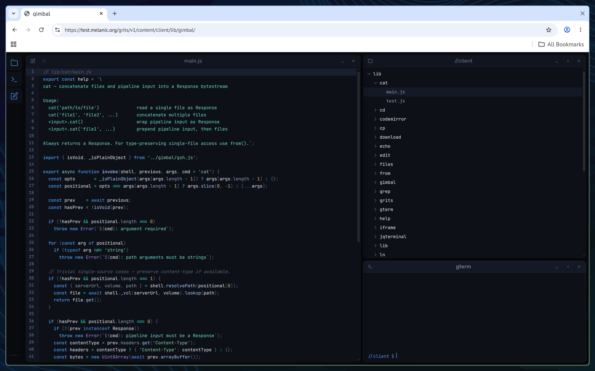
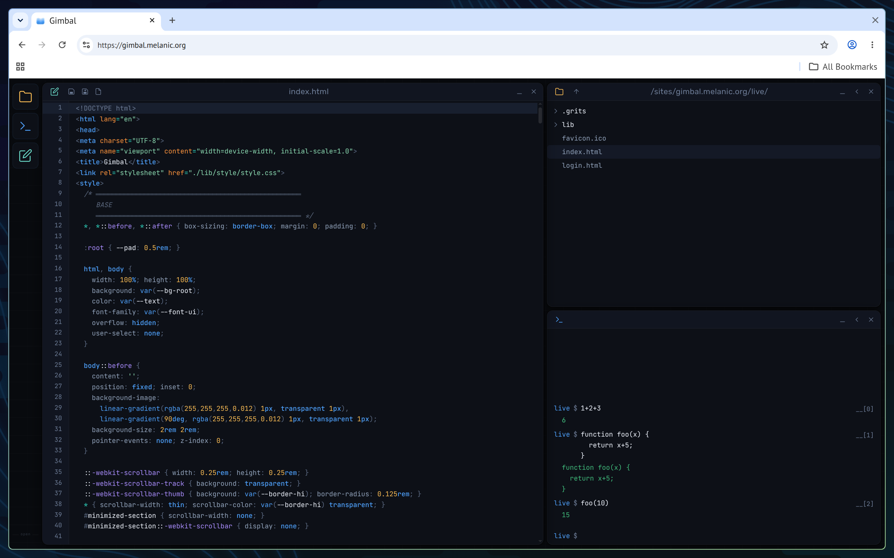
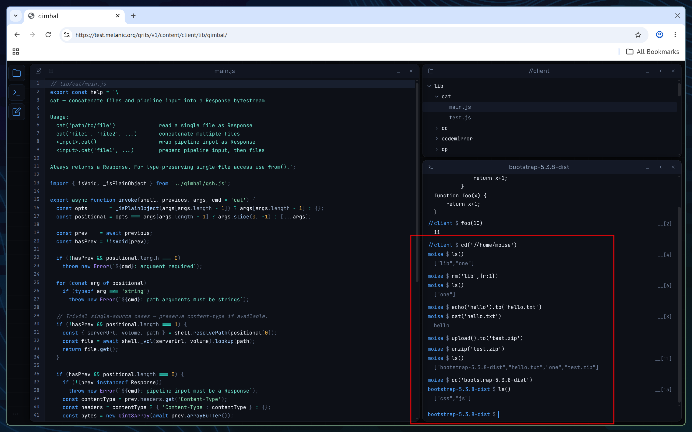
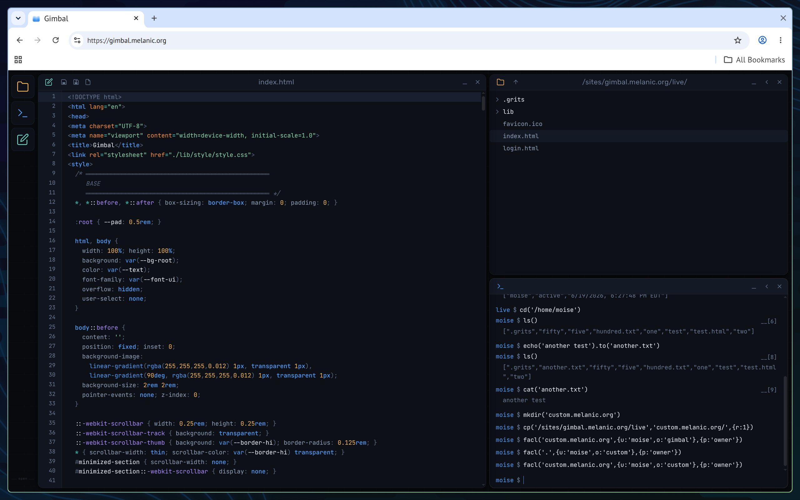
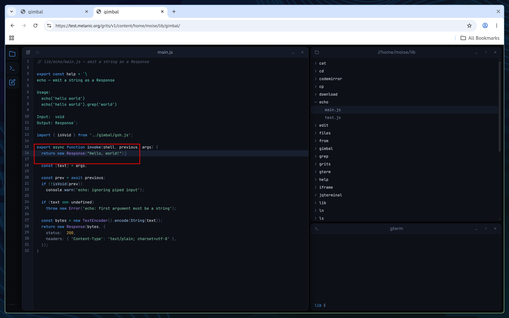
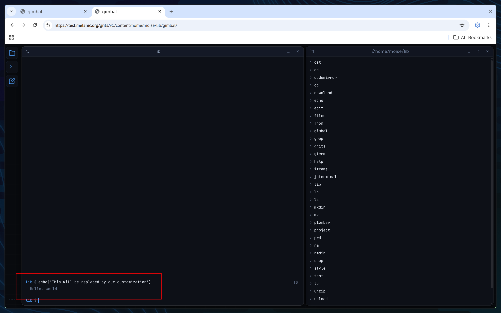
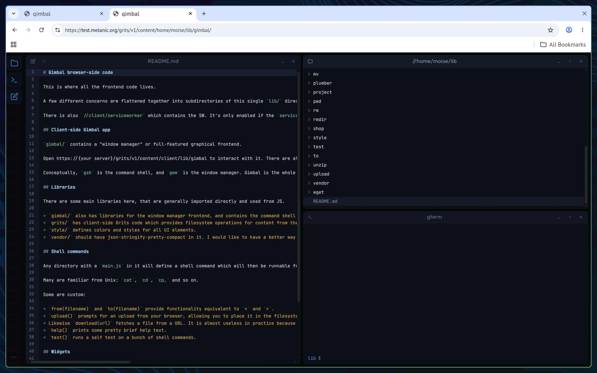
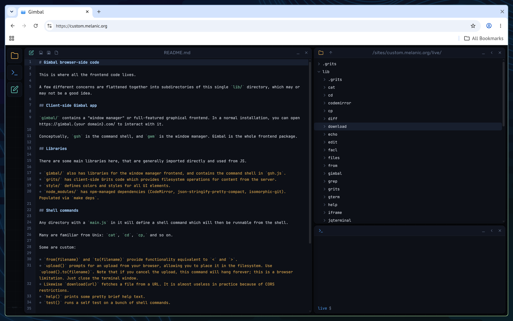
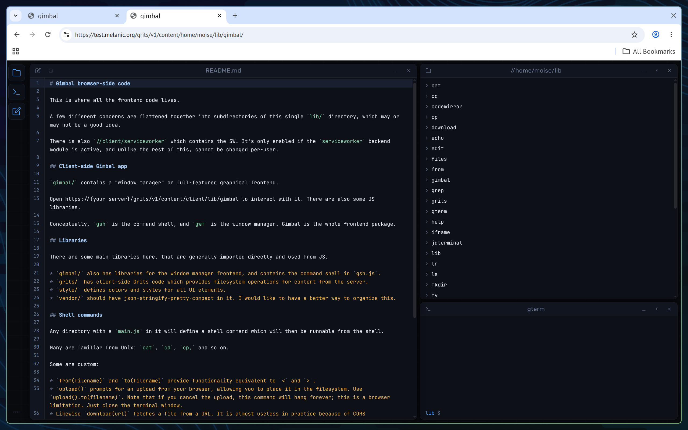

# Gimbal - A framework for web-native development

It's a little web framework, which lets you interact with a web site or application much more directly and flexibly than you usually can.

As an end-user of a site deployed on Gimbal, you can:

* Directly examine the underlying data and code
* Persistently edit the UI of the web site you're using, for you, without impacting other people's experience
* Interact and script interactions with the site in ways not programmed in advance by the authors/operators

As an admin, you can:

* Easily test, deploy or roll back versions of the site
* Do first-class development and devops things from your browser
* Replicate content to mirrors, and have them seamlessly assist with the load on the main site

Note: This is all still an ambitious work in progress. It's a hobby project. It works on my machine. **It also may eat your data at any time; there are known volume-storage-corrupting bugs I haven't sorted out yet.** And **there are no permissions; everyone can write to any of your data that isn't set read-only at the HTTP or volume level.**

**Don't use this in production.** Basically, some things work and it's fun for tinkering but it's very far from a working version 1.

## Examples

Here's what it looks like:



You can see a terminal, a files browser, and an editor. Pretty straightforward.

Terminal commands are interpreted more or less as javascript syntax. You can do javascript things:



But you can also run Unix-like commands and interact with the little filesystem:



These commands are chained together via Response bytestreams, with function chaining analogous to `|` in Unix. `.to()` is analogous to `>`, `from().` is almost analogous to `<`.

The files you're editing are in the server's storage. The system is backed on a Merkle tree, which makes it natural for the browser to maintain its own local version of the store while maintaining cache-coherency guarantees. It also means it's easy to make copy-on-write copies of big things for your own use and modification.

This means you can make copies of anything the server is running, which then become your own things you can modify as you like, or take somewhere else. As an example, we make a copy of `/lib` so we can customize this whole admin interface:



We load up the site from our home directory instead, which is just as much runnable as the other, but is also fully editable:



We make a change to `echo()`:


We reload the tab, and execute `echo()`, and we observe that our changes are live (which doesn't muck anything up for existing users of the main app in `/lib`):



It's obviously not limited to that one tool. All the code for the environment you see can be edited. There's a README with guidance about where things are located within lib/:



Look at that -- it's hard to read because the lines aren't wrapped. Not a problem. We open up our editor widget (which is a wrapper around Codemirror), and make the one-line fix to add the line wrapping extension:



We reload the tab and open the README again:



Bingo bango. It's actually quicker as a non-site-admin to make the line-wrap edit, than it would be to make a change on the backend and rebuild+restart+whatever, if you *were* the admin.

You get the idea.

## Motivation

It might be obvious from the demo why this would be useful, but in a broader sense the motivation is this:

Internet technology is and was based on a peer-to-peer and open-software vision, but the modern web is very much stuck into a mainframe style priests-and-outsiders structure. (In fact, for business reasons, it is going backwards. Fewer and fewer priests are maintaining ever more massive and restricted temples, which you the user are ever more powerless to interact with as a full citizen.) As an end-user, you're incapable of interacting with web sites in ways that are natural if you are an open-source type of person, even in the case when the backend is (from the administrator's POV) open source. You're left with weird little scraps, like being able to export your data or paste a custom block of CSS, that don't really scratch the surface of what you should be able to do to control your experience and your data.

On the admin side, compounding those user-side issues, there are significant centralized hosting issues that still haven't gone away. Bittorrent is great, ActivityPub is great, but popular sites still run on expensive centrally-served hosting. People still invest in S3 to run their Mastodon nodes. My vision would be that, in addition to the user side getting better, it could become realistic to run something like a busy Mastodon node or Peertube instance, and have a substantial amount of the hosting being done by the users.

Basically, the idea for this project is to provide a framework which is akin to minicomputers instead of mainframes, or to open source instead of Windows.

## Quickstart

### Build

It only works on Linux right now.

To play around with it, do this:

* Install golang >= 1.22.12
* `sudo apt install fuse3 certbot` or equivalent
* Check out the source
* Run tests: `go test ./internal/... ./cmd/...`
* Assuming the smoke tests pass, build:
    * `go build -o bin/certbot-helper cmd/certbot-helper/main.go`
    * `go build -o bin/gritsd cmd/gritsd/main.go`
    * `go build -o bin/grits cmd/grits/main.go`


### Configure

```
cp sample-config.json config.json
hx config.json # Or whatever editor
```

You will need to make changes to the config. 

Change `%USER%` to your Unix username, and `%EMAIL%` to your email (email is only needed for certbot interactions -- the system will automatically grab HTTPS certificates for you, by default, and certbot wants your email in order to do that.)

### Run

Assuming everything checks out, you're good to start the actual service (foreground-only for now, you can use `tmux` if you like):

```
sudo bin/gritsd
```

It'll drop privileges to whatever user you configured for it, as soon as it's opened the ports it needs. If you want to try it as non-root, just configure it on a port above 1024 and run certbot by hand to get certificates if any, and then you can run without `sudo`.

### First-time setup

Once the server is running, the FUSE mount at `mnt/` gives you access to the volume. You'll need to add users and set up the initial filesystem skeleton:

(Note - if you shut down the server while files in the FUSE mount are open, it will refuse to shut down so as to not leave a stale mount behind. Just close any open files/cd out of the FUSE mount, unmount the FUSE mount, and the server shutdown should automatically continue as normal and finish.)

```
# Populate the volume with the initial filesystem skeleton.
# This sets up directory structure and permissions for core system directories.
cp -r skel/* mnt/
cp -r skel/.grits mnt/.grits
cp -r client/lib mnt/

# Create the admin user and an account for yourself.
bin/grits adduser glenda
bin/grits adduser your-username

# Create a blank vhost for your machine
mkdir mnt/sites/{your hostname}

```

### Test

Once you've done that, you should be able to log in to see the Gimbal shell at:

`https://{your server}/grits/v1/content/root/gimbal/index.html`

If you see the graphical interface from the screenshots, you're in.

Run `test()` at the command line to run a detailed frontend test. It'll take a while.

If you are brave enough to try the service worker, you can also enable the module, and then go to `https://{your server name}/grits/v1/content/root/lib/serviceworker/swtest.html` for some self tests of loading and updating the service worker. Assuming that checks out, you can re-run the client side `test()` tests from the shell, with the SW active, to give it a more substantive test. Bear in mind that the SW currently works in Chrome, but not in Firefox, and I don't know why.

### Web Serving

Assuming all the tests work, you can start populating your own content. `upload().to(filename)` and `unzip(filename)` may be useful. Bear in mind that it is trivial to maintain multiple copy-on-write versions of the site content:

```
cd('/sites/{your server}')
mkdir('dev/v1',{p:1})
echo('version 1').to('dev/v1/index.html')
ln('dev/v1','content',{ff:1})
```

(That `ff` option requests to forcibly overwrite whatever's in `content` with a copy of `dev/v1`, without the normal Unix semantics of creating a new file within `content/` if `content/` already exists.)

If you want to work on a v2 of the site:

```
ln('dev/v1','dev/v2',{ff:1})
```

And then, make edits to `dev/v2`, and then you can observe them at `https://{your server}/grits/v1/content/root/sites/{your server}/dev/v2/`, and then if you like them you can use another `ln` command to deploy them to `content/` which will place them onto the "live site."

Hopefully this all gives the flavor of the intent. When you're done, hit Ctrl-C on the backend and the server should shut down cleanly. If it hangs because it can't unmount the FUSE mount, just end the processes that are keeping the FUSE mount busy and then unmount it yourself, and the shutdown should continue from there.

And yes it's on the roadmap to make it runnable via systemctl, and file permissions so that not everyone can see and edit `/sites/{your server}/dev`. Both of those things would be good to add.

## How It All Works

Nomenclature-wise, the system is split into two cooperating pieces:

* **Gimbal** is the frontend which provides a Unix-like shell and "window manager" of sorts that runs in the browser and can do operations on the filesystem.
* **Grits** is the backend, the server that hosts Gimbal and provides a read-writable space with useful primitives for sharing and replicating content. More or less, it is the filesystem, and Gimbal is the desktop environment.

### Design philosophy

There are a few overarching goals that define a lot of the shape of the system:

* **Everything from the frontend**. As much as is feasible, any file that defines operation of the system should be within the frontend's file store so that you don't have to drop back to the backend or `ssh` into anything to change things. The backend reads its configuration from the same place, so things aren't awkward to configure from a server admin perspective.
* **Convention, not configuration**. Frontend code lives in `/lib/{tool}`, user home directories are `/home/{username}`, vhost content is in `/sites/{hostname}/content`. Shell commands are enabled by creating a file `/lib/{command}/main.js`. And so on. We don't do layers of indirection where we can avoid them.
* **JSON for everything**. Either JSON or JSONL is used as the universal format for the system's metadata and configuration.
* **Use familiar names**. We imitate Unix commands and filesystem organization as much as is sensible, to avoid forcing people to learn new models or new names for things.

The overall goal is that the system is transparent and comfortable to modify.

### Frontend Piece (Gimbal)

"Gimbal" refers to the whole frontend system, notably including `gsh` the command shell and `gwm` the "window manager". Within `gwm` are widgets including `gterm` the terminal, and a file browser and editor which are creatively titled `files` and `edit`.

The shell the system presents is basically just a Javascript console with a couple extra features.

You can type javascript commands:

```
$ 1+1
2
```

You can also type Gimbal-specific shell commands, and pipe them together, like Unix:

```
$ cd('/sites/{your server}')
$ upload().to('test.zip')
$ unzip('test.zip')
$ ls()
["bootstrap-5.3.8-dist","test.zip"]
$ cd('bootstrap-5.3.8-dist')
$ ls()
["css","js"]
```

#### Paths

Your home directory is in `/home/{username}`. All the Gimbal code lives in `/lib`. There are some various other directories created, or stubbed into place, in various locations:

* `/home/{username}` - Home directories
* `/home/{username}/local/{app name}` - Application-specific data (per user)
* `/lib/{app name}` - Application code
* `/opt/{app name}` - Application-specific variable data (system wide)
* `/sites/{hostname}/content` - Public web space for {hostname}
* `/sys/etc` - System configuration
* `/sys/log` - Logs
* `/tmp` - Temp files

`..` works, but it is a shell thing. The filesystem itself doesn't interpret that filename as special in any way.

There are no symbolic links.

You can use `glob({pattern})` to get a list of files matching the pattern. It's not a "shell command," just a normal async function, so you will have to do things like `rm(... await glob('*.txt'))`.

#### Permissions

The permissions system is very specifically adapted to the needs of this system.

* The filesystem enforces permissions at the directory level. Files have no permissions which are distinct from the directory they're placed in.
* The default is no access. Permission must be explicitly granted.
* Grants of access also apply recursively to directories lower down than the specified directory. There is no way to revoke a permission on a subdirectory, if a parent directory has it. (This is, somewhat, a consequence of the Merkle tree structure.)
* Grants of access apply according to both the user, and the application (the origin) which is making the request.

So, in practice, the root directory is forbidden to all non-superusers, and grants of access accumulate irreversibly as you go deeper into subdirectories.

Again, grants of access are specified in terms of *both* to a specific user, and an origin (the scheme+host of the page making the request). The granularity of the permission model is per-origin: all pages running on the same vhost share the same origin, and thus the same permissions. If you visit `evil.example.com`, it will not be able to access anything from `gimbal.example.com` even though you hold a token for your user all across `example.com`.

An example might help.

* `/home/moise` will be read/writable by `moise`, but *only* when being accessed from the origin `https://gimbal.example.com`.
* `/home/moise/local/music-player/` could be read/writable by the music app, but *only* when being accessed from the origin `https://music.example.com`.

This means that, running the Gimbal shell, `moise` can examine the music player's application data and make changes to it. The music player can operate on its own data however it will need to. However, even though it carries a token for `moise`'s user, the music player cannot read or write anything from `moise`'s files outside its permitted area, nor can any other code that doesn't originate from `https://gimbal.example.com`.

Now say that `moise` wants to set up his own custom Gimbal shell on a different vhost, `https://dev.moise.example.com`. He adds a grant of access on `/home/moise` to his own user when accessed from that origin. Both vhosts can now access the same data. No other origin can access `/home/moise` unless specifically allowed.

The key factor here is that any random person can code up `music.example.com`, create a vhost for it, and it will be safe for `moise` to go to that page and interact with it, and it'll have precisely the permissions it should have without being able to read or write things that it shouldn't.

There are other more sophisticated access patterns possible. Notably, all users may have `read+insert` permission in `/var/music-player`, meaning that they can all write data to that location, but no user can interfere with the other users' data.

These grants of access come in plain files located at `./.grits/access.json` within each directory that access is being granted to. Look around at `access.json` files in `skel/` to get a sense of how they're structured; they are simple.

The full set of access types is:

* `read`
* `read+insert`: You may read all data in this directory, but you may not modify this directory or subdirectories. You can *insert* files only (create links which did not previously exist). You can either use this to create an append-only store, or you can use a pattern where users make populated subdirectories which come with grants of access for those users only, so that each person has their own read-writable store and can read other users' stores (but not interfere with them).
* `insert`: Same, but write-only. No user may read back the files which have been appended inside.
* `read+write`: You may read or write any data in this directory *except* that you may not modify the `.grits` directory in it. (You may modify `.grits` directories in subdirectories). This can be used for example to give someone read/write access to a directory without letting them lock you out of it by removing your own permissions to it.
* `owner`: You can read or write anything in this directory, and control permissions by modifying files in `.grits` (including the access control file).

The way that permissions at one level apply to subdirectories below that level falls out as a natural consequence of being able to make reads or writes to the Merkle tree at that exact specific level. Mostly, they simply carry down recursively, but `write` turns into `owner` at lower levels, and `insert` does not itself allow any modification at lower levels.

The frontend shell tool `facl()` is used to modify directory permissions. Run `help('facl')` to see more about how to use it and how grants of permission look.

Note that the `origin` is such a critical piece of this security that it *must* be specified with any grant of permissions. There are two special values:

* `"*"` grants access to *any* origin. You might use this for a vhost whose files are meant to be media for some separate external site. Use it deliberately; it removes the origin half of the protection entirely. Mostly, you will want to copy files into /sites/{a vhost}/content instead of granting access across vhosts. Remember, copies are just Merkle tree links; they are basically free.
* `"/"` is shorthand for the origin of the **core vhost** -- the main vhost the server is configured to serve Gimbal from (e.g. `https://gimbal.example.com`). The server expands `"/"` to that origin when it reads the grant, so you don't have to hardcode your hostname into every `access.json`. If you want to grant something to "the human," then use this, and the human will have access to it through the Gimbal shell application.

Note: Permissions are enforced only at the namespace level — blobs are stored in plaintext and served to anyone who has the CID. Don't store anything secret here. In particular, content with few possible values can have its CID guessed, so this can bite even where you didn't think you were storing a secret — a PIN or password check can leak this way. (Real confidentiality is a someday-feature via client-side crypto, not CID secrecy. And don't use this in production yet regardless.)

#### Authentication

Auth has two layers: **global** (persistent cookie) and **per-session** (tab-local header). By default `login('user', 'pass')` logs in just the current tab. Pass `{g:1}` (e.g. `login('glenda', 'pass', {g:1})`) to also set a persistent cookie so new tabs pick up the login automatically.

The server checks the tab's session header first, then falls back to the global cookie. This means you can have a global identity (cookie) while a specific tab runs as a different user (session header).

For a superuser operation, do `login('glenda')`, then `logout()` when done, and optionally `login(normal_user, {g:1})` after to restore your global identity. It's a little clunky but it works. (Down the road, opening a separate tab as `glenda` for isolated commands would be cleaner — and when we have configurable session timeouts, you could set a shorter one for admin sessions and close the tab when done.)

Use `whoami()` to see who you're authenticated as.

#### Chaining

The way commands chain is a little complex. Generally speaking, shell commands return a `Result`, which can have functions called on it which then go via the same proxy as the shell uses to find commands. When called on a `Result`, commands will chain together with the output from the command that created that `Result`.

Commands are implemented in `/lib/{command name}/main.js`. See the comments at the top of `/lib/gimbal/gsh.js` for more about the details of how this all works.

### Web Hosting

From the Gimbal shell, you can move stuff into `/sites/{your server}/content` and it'll show up in the root of `https://{your server}/`. You can also make arbitrary new directories under `/sites` which will effectively make new vhosts (assuming you've arranged for DNS for whatever vhost to point to your server).

(You can, if you like, set up a DNS wildcard so that `*.{your server}.com` all points to the server where Grits is running. In that case, anything that gets placed in `/sites/{whatever}.{your server}.com/content` will become a live site automatically. This may be useful for testing.)

### Backend Piece (Grits)

The "filesystem" here is specifically constructed with operating principles that are useful to Gimbal-style apps, as well as general file replication operations that are useful for any static content. It is implemented as a Merkle tree, which provides several advantages:

* We can easily tell what does and doesn't need to be updated in our local view of remote content, simply from doing a single fetch of the root CID.
* We can verify content that comes from a semi-untrusted source, which allows us to deploy mirrors while limiting the level to which we need to trust them.
* We can easily incorporate useful features like file history, copy-on-write semantics, and atomic operations, by leveraging the CID as a descriptor of all content below it.

It's also nice for cache coherency. If the service worker is enabled, then we won't have to set cache expiry times or tell people to try shift-reload when at some point the caching inevitably goes wrong.

#### Storage format

All the data is stored as blobs within the Merkle tree, with metadata in JSON format. File identifiers (analogous to inode numbers, or to CIDs within IPFS) look like this:

```
QmcdHV2KQTu59Mq5Aw5jDJXN2CZGKoW68G8pc7jJPvbQ1C
```

Fetching that blob will give you metadata:

```
{"type":"dir","size":61,"contentHash":"QmbjmTt4aJL6p6dZRZMhNomNo3nBaDdoQCGRnk9DrFBMJw","mode":493,"timestamp":"2026-04-16T19:29:57Z"}
```

"type" may be "dir" or "blob"; the content for a blob is just the contents of the file, and the content for a directory is a map of the filenames to their own metadata hashes. In this case, the directory has only one file; reading QmbjmTt4aJL6p6dZRZMhNomNo3nBaDdoQCGRnk9DrFBMJw will yield:

```
{"dest.txt":"QmWxZmx2Ej4BfUCEBSChn8p2NiLy1DGSg3zqB3othfktVL"}
```

And QmWxZmx2Ej4BfUCEBSChn8p2NiLy1DGSg3zqB3othfktVL will contain the metadata node for the file in question:

```
{"type":"blob","size":5,"contentHash":"QmRN6wdp1S2A5EtjW9A3M1vKSBuQQGcgvuhoMUoEz4iiT5","mode":420,"timestamp":"2026-04-16T19:29:56Z"}
```

And so on.

#### Operations

There are four main operations available on a Grits filesystem.

* **get(cid)** will return the bytestream for a given CID.
* **put(cid, bytes)** will insert data for a new CID into the blob store, if it is not already present.
* **lookup(path)** resolves a path within the namespace.
* **link(path, cid)** defines a path to point to a particular metadata CID, overwriting any previous value. Linking to
`nil` or `""` will delete the given path, removing it from its parent's directory listing.

`lookup` and `link` will do a good bit of looking around in the blob store to execute; you could do that remotely also (by fetching blobs to walk down the tree manually), but that would be very slow. Lookups, in general, will return the LookupResponse structure from `namestore.go`.

#### Atomicity

Both lookup() and link() take any number of paths in their argument, and link() allows you to make assertions about the current state of the filesystem (for example asserting that a path you are writing is `nil` previous to the write, if you want to guard against overwriting a previous entry). This combination allows for atomic operations. In particular, you can serialize big operations on the file store via an OCC approach: First gather the existing state of what you want to modify, then execute a write which asserts that everything you're modifying has the value you previously observed. Then, on an assertion failure, re-read and try again until the assertion succeeds, which means the write has finally succeeded.

#### Notifications

Another thing which falls out of this naturally is watches for modification -- simply keep an eye on the CID of any file or directory node, and if it changes, it's been modified.

#### Performance

The remote performance is pretty mediocre right now. It should be possible to do prefetching more cleverly than we're doing now. Also, when configured to (when concurrent access isn't expected), we should batch up writes into long lists of write-back-cached "path/CID/assertions" tuples which we are committing from a background thread. That should make it better. But, for now, it's not super fast when doing I/O remotely with writes involved.

Reading (serving the read-only bits of the site) should already be faster than a normal web site, if the service worker is enabled. Try it out, see if that's the reality.

#### Mirrors

There is a subsystem that is intended to run a network of mirrors for Grits content (module_mirror.go, module_origin.go, and so on). It was working in a first-cut state, as of a while ago, but it may need some updates to work in the current codebase.

#### Roadmap

There are some pretty essential improvements which are planned for the near future:

* File permissions and authentication / user management
* Automatic copy-on-write backups and file history
* Fixes to naming conventions, versioning of file formats, new stabilized version of file and wire formats

## Code layout

### `internal/grits`: Core. Blob storage, configuration, the namespace, and so on. 

* `structures.go` defines core interfaces used throughout
* `blobstore.go` defines the blob storage (mapping of content hash -> actual content)
* `namestore.go` defines the mapping of path names to content hashes

### `internal/gritsd`: Server implementation

* `server.go` defines the actual server implementation.
* `modules.go` defines an interface for "modules" added to the server. Almost all the server's functionality is implemented via these modules. You will see many of them; of particular importance the ones listed in the next (config.json) section.

### `config.json`

This is the core config file. Most of it involves configuring particular modules. There are a decent number, in a variety of states of working-ness, but you can see a quick sample in the sample config. Some among them that may be useful and somewhat-work right now are:

* `volume` provides a local writable volume of storage
* `mount` creates a FUSE mount of a particular volume to a local directory
* `http` creates an HTTP endpoint providing access to the API
* `serviceworker` sets up a service worker which will run all web accesses through a client-side Grits cache automatically, so these benefits apply to any content. (Note: Currently the SW works on Chrome, but not completely on Firefox; for what reason, I don't know.)
* `startup` provides a list of backend commands to run on startup. See the next section.

Check out the source in `internal/gritsd/module_{whatever}.go` to see the configuration for each.

### Backend Commands

Most administration of the server should be done from the frontend. But there are a couple of things which can't be done from the frontend or are needed for bootstrapping.

If you enable the `cmdline` module on the backend, then you can type things like:

* `bin/grits ping` to test the command pipe
* `bin/grits import local/path //volume/dest/path` to import files from your Linux filesystem into Grits's file store
* `bin/grits adduser username` to add a user (you will be prompted for the password)
* `bin/grits deluser username` to delete a user

### Other useful directories

* `client/` defines vital client-side content. On initial setup it gets imported into `/lib` in the filesystem, so that clients can access it.
* `var/` is where all writable data for the server is kept. It should be fine (and is recommended) to have the entire `grits/` directory outside of `var/` owned by a different user, and read-only from the POV of the server process.

## In Conclusion

See? It's neat.

(TODO - discord link)

## Enjoy!

Comments? Questions? Feedback? Let me know.